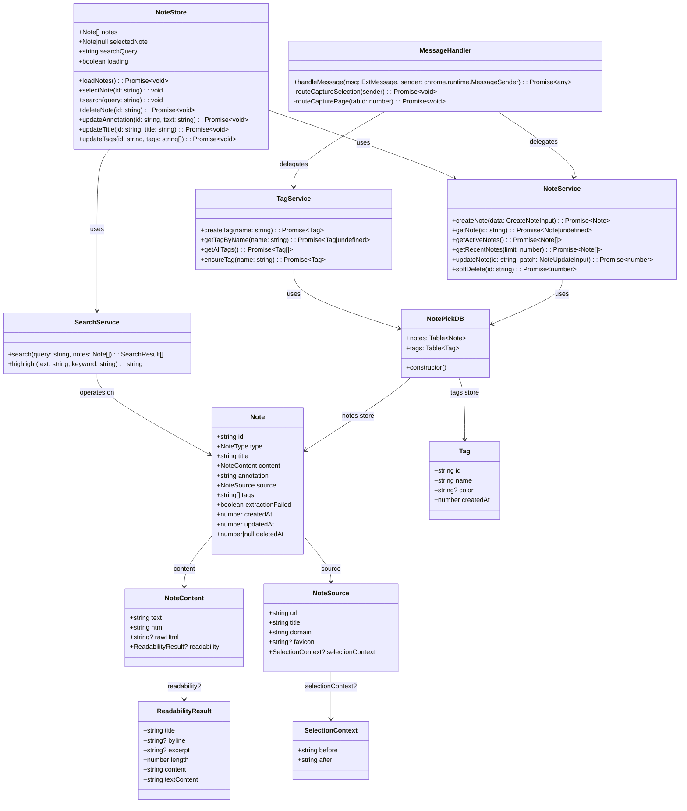
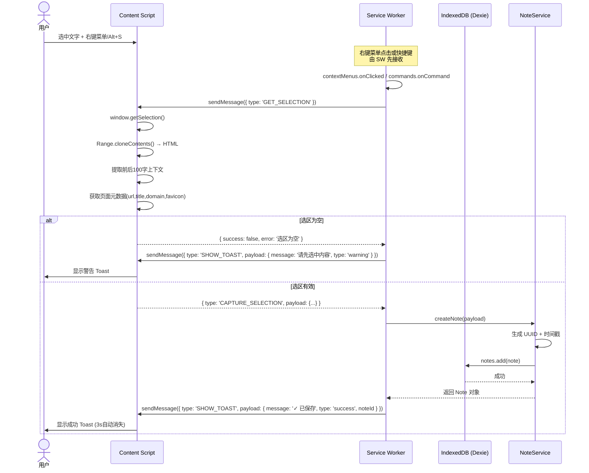
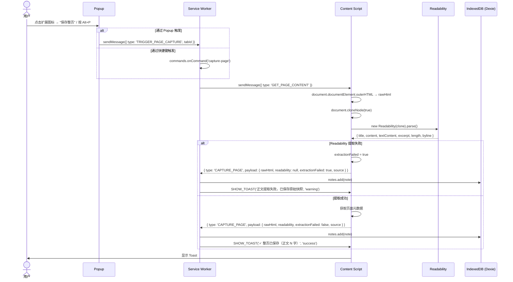
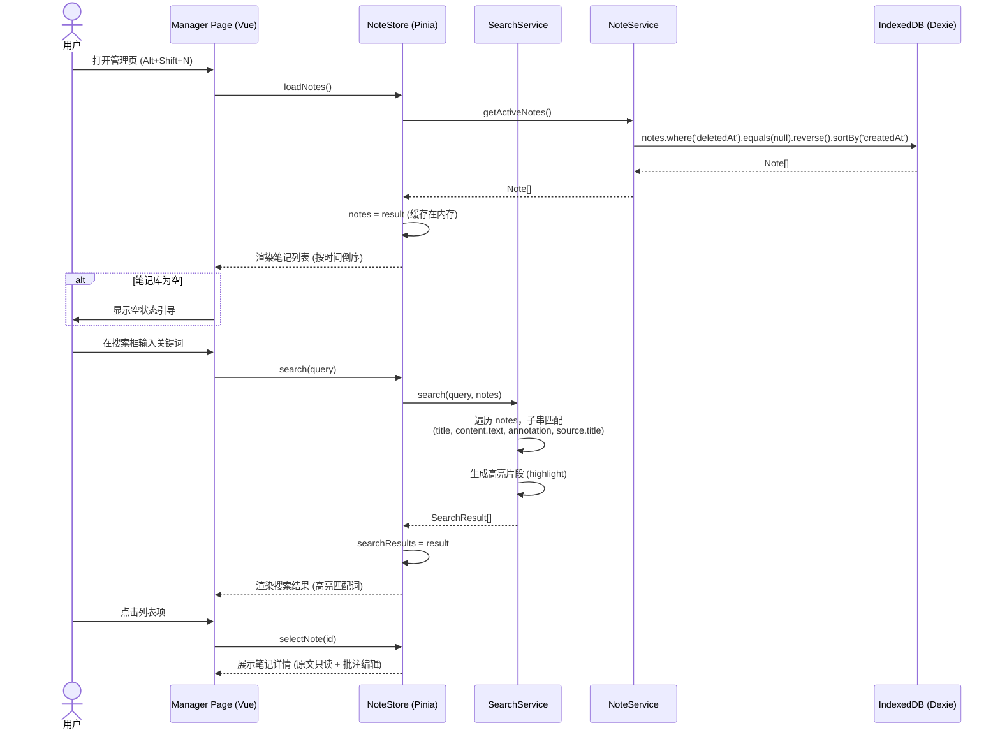
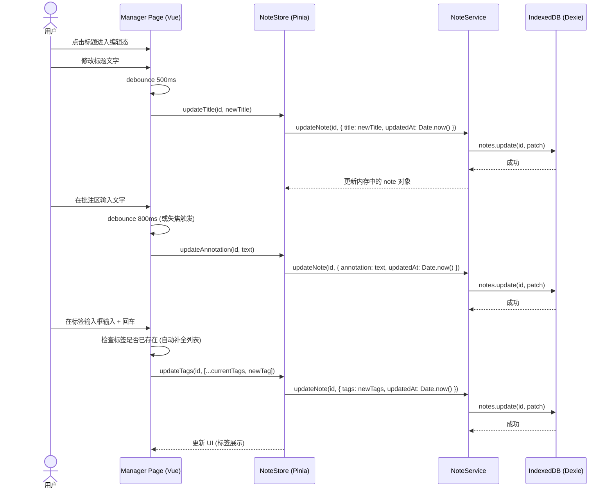
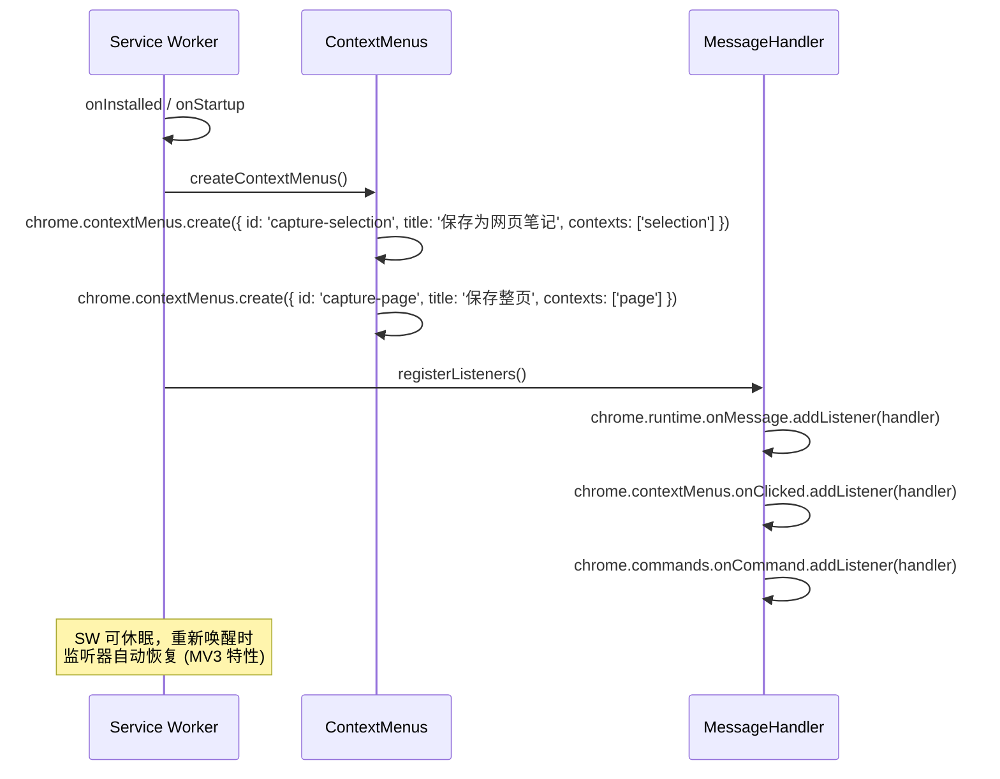
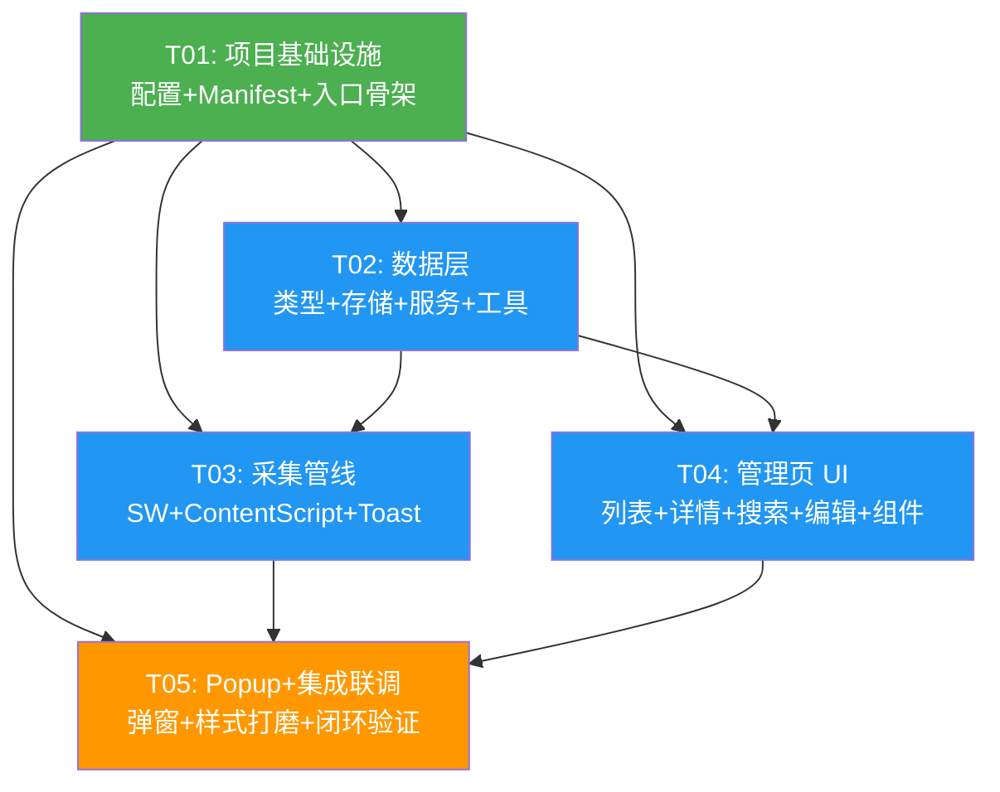

# NotePick 系统架构设计文档

> 文档类型：System Architecture Design
> 版本：v1.0
> 创建日期：2026-07-21
> 上游文档：`PRD-MVP.md` v1.0
> 架构师：高见远

---

## 目录

- [Part A: 系统设计](#part-a-系统设计)
  - [1. 实现方案](#1-实现方案)
  - [2. 文件列表](#2-文件列表)
  - [3. 数据结构与接口](#3-数据结构与接口)
  - [4. 程序调用流程](#4-程序调用流程)
  - [5. 待明确事项](#5-待明确事项)
- [Part B: 任务分解](#part-b-任务分解)
  - [6. 依赖包列表](#6-依赖包列表)
  - [7. 任务列表](#7-任务列表)
  - [8. 共享知识](#8-共享知识)
  - [9. 任务依赖图](#9-任务依赖图)

---

# Part A: 系统设计

## 1. 实现方案

### 1.1 核心技术挑战分析

| 挑战 | 难点 | 解决方案 |
|------|------|---------|
| **Readability 无 DOM 环境** | Readability 依赖 DOM API，MV3 Service Worker 无 `document`/`window` | Content Script 中执行 Readability 解析，将结果序列化后传给 SW 存储 |
| **MV3 SW 生命周期** | Service Worker 空闲 30s 后休眠，可能导致消息丢失 | 消息处理设计为幂等；长操作用 `chrome.runtime.sendMessage` 的 Promise 回调保持 SW 存活；不依赖 SW 持久状态 |
| **多入口构建** | 扩展有 4 个独立入口（SW、Content Script、Popup、Manager），各自打包需求不同 | 使用 `@crxjs/vite-plugin` 统一管理多入口构建，自动处理 manifest 引用 |
| **跨上下文通信** | Content Script ↔ SW ↔ Popup ↔ Manager 四方消息传递 | 定义统一的 discriminated union 消息类型，通过 `chrome.runtime.sendMessage` / `chrome.tabs.sendMessage` 路由 |
| **1000 条搜索 < 300ms** | IndexedDB 查询 + 内存过滤的性能平衡 | Manager 页面首次加载全量笔记到内存（Pinia store），搜索在内存中做子串匹配，避免每次查询都走 IndexedDB |
| **样式隔离** | Content Script 注入的 toast 不能污染宿主页面样式 | Toast 使用 Shadow DOM 隔离；Manager/Popup 使用 Tailwind CSS + Vite 的 CSS scoping |

### 1.2 框架与库选型（最终确认）

| 模块 | 选型 | 版本 | 理由 |
|------|------|------|------|
| 扩展规范 | Manifest V3 | — | Chrome 推荐标准 |
| UI 框架 | Vue 3 + TypeScript | ^3.4 | 用户已确认；Composition API 适合复杂状态管理 |
| 构建工具 | Vite 5 + @crxjs/vite-plugin (v2 beta) | ^5.0 / ^2.0.0-beta | MV3 专用构建插件，自动处理 manifest/HMR/多入口 |
| 状态管理 | Pinia | ^2.1 | Vue 3 官方推荐状态管理，轻量且 TS 友好 |
| 正文提取 | @mozilla/readability | ^0.5 | Mozilla 官方维护，成熟稳定 |
| **存储封装** | **Dexie.js** | ^4.0 | **最终决定使用 Dexie.js**：提供 Promise API、TypeScript 类型推导、索引声明式定义、版本迁移管理，比原生 IndexedDB API 开发效率高 3-5 倍 |
| **样式方案** | **Tailwind CSS** | ^3.4 | **最终决定使用 Tailwind CSS**：原子化 CSS 零运行时开销，与 Vue SFC 配合好，Manager 页 UI 组件多时开发效率高；Content Script toast 用 Shadow DOM + 内联样式隔离 |
| UUID 生成 | uuid (v9) | ^9.0 | 轻量可靠的 UUID v4 生成 |
| 图标 | @iconify/vue | ^4.1 | 按需加载图标，体积小 |

### 1.3 架构模式

采用**分层架构 + 消息总线**模式：

```
┌──────────────────────────────────────────────────────────────┐
│                        UI 层 (Vue 3)                          │
│  ┌─────────────┐  ┌──────────────────┐  ┌────────────────┐  │
│  │   Popup     │  │  Manager Page    │  │ Content Script  │  │
│  │  采集入口    │  │  列表/详情/搜索   │  │  选区/整页采集   │  │
│  │  最近笔记    │  │  编辑/批注/标签   │  │  Toast 反馈     │  │
│  └──────┬──────┘  └────────┬─────────┘  └───────┬────────┘  │
│         │                  │ (直连 IndexedDB)     │           │
│         │ chrome.runtime   │                      │           │
│         │ .sendMessage     │                      │           │
├─────────┼──────────────────┼──────────────────────┼───────────┤
│         ▼                  ▼                      ▼           │
│  ┌─────────────────────────────────────────────────────────┐ │
│  │              Service Worker 层 (后台逻辑)                │ │
│  │  ┌──────────┐  ┌───────────┐  ┌──────────┐  ┌────────┐ │ │
│  │  │ 消息路由  │  │ 采集处理   │  │ 右键菜单  │  │ 快捷键  │ │ │
│  │  │ Router   │  │ Capture   │  │ Context  │  │Command │ │ │
│  │  └────┬─────┘  └─────┬─────┘  └──────────┘  └────────┘ │ │
│  │       │              │                                    │ │
│  │  ┌────▼──────────────▼──────────────────────────────┐   │ │
│  │  │              Service 层 (业务逻辑)                 │   │ │
│  │  │  NoteService  │  TagService  │  SearchService     │   │ │
│  │  └───────────────────────┬──────────────────────────┘   │ │
│  └──────────────────────────┼──────────────────────────────┘ │
│                             │                                 │
├─────────────────────────────┼─────────────────────────────────┤
│                    存储层 (Dexie.js → IndexedDB)               │
│                   ┌─────────┴─────────┐                       │
│                   │  notes  │  tags   │                       │
│                   └───────────────────┘                       │
└──────────────────────────────────────────────────────────────┘
```

**关键架构决策**：

1. **Manager Page 直连 IndexedDB**：Manager Page 是 `chrome-extension://` 页面，可直接访问 IndexedDB，无需经过 SW 中转。搜索和 CRUD 操作直接走 Dexie.js，减少消息往返开销。
2. **Content Script 负责 DOM 操作**：选区提取、Readability 执行、Toast 渲染均在 Content Script 中完成，SW 只负责路由和存储。
3. **SW 作为采集编排中枢**：右键菜单点击、快捷键触发由 SW 接收，SW 再向 Content Script 发消息请求 DOM 数据，收到后存入 IndexedDB。

---

## 2. 文件列表

```
NotePick/
├── package.json                          # 依赖声明 + 脚本
├── vite.config.ts                        # Vite + crxjs 构建配置
├── tsconfig.json                         # TypeScript 配置
├── tsconfig.node.json                    # Node 环境 TS 配置 (vite.config 用)
├── tailwind.config.js                    # Tailwind CSS 配置
├── postcss.config.js                     # PostCSS 配置 (Tailwind 依赖)
├── .gitignore                            # Git 忽略规则
├── popup.html                            # Popup 入口 HTML
├── manager.html                          # Manager 管理页入口 HTML
├── src/
│   ├── manifest.ts                       # Chrome MV3 Manifest 定义
│   ├── types/
│   │   ├── index.ts                      # 数据模型类型 (Note, Tag, etc.)
│   │   └── messages.ts                   # 消息协议类型 (discriminated union)
│   ├── services/
│   │   ├── db.ts                         # Dexie 数据库定义 (schema + indexes)
│   │   ├── noteService.ts                # 笔记 CRUD + 软删除
│   │   ├── tagService.ts                 # 标签 CRUD + ensureTag
│   │   └── searchService.ts              # 全文搜索 (内存子串匹配)
│   ├── background/
│   │   ├── index.ts                      # Service Worker 入口 (初始化 + 事件监听)
│   │   ├── contextMenus.ts               # 右键菜单创建与点击处理
│   │   └── messageHandler.ts             # 消息路由 (接收→分发→响应)
│   ├── content/
│   │   ├── index.ts                      # Content Script 入口 (消息监听)
│   │   ├── selectionCapture.ts           # 选区提取逻辑 (getSelection + context)
│   │   ├── pageCapture.ts                # 整页 DOM 获取 + Readability 执行
│   │   └── toast.ts                      # Toast UI (Shadow DOM 注入)
│   ├── popup/
│   │   ├── main.ts                       # Popup Vue 应用入口
│   │   └── App.vue                       # Popup 根组件 (采集按钮 + 最近笔记)
│   ├── manager/
│   │   ├── main.ts                       # Manager Vue 应用入口
│   │   ├── App.vue                       # Manager 根组件 (布局)
│   │   └── views/
│   │       ├── NoteListView.vue          # 笔记列表视图 (列表 + 搜索)
│   │       └── NoteDetailView.vue        # 笔记详情视图 (内容 + 编辑)
│   ├── components/
│   │   ├── NoteCard.vue                  # 笔记列表卡片
│   │   ├── SearchBar.vue                 # 搜索输入框
│   │   ├── TagInput.vue                  # 标签输入 (自动补全)
│   │   ├── AnnotationEditor.vue          # 批注编辑器 (自动保存)
│   │   ├── EmptyState.vue                # 空状态提示
│   │   └── Sidebar.vue                   # 侧边栏 (标签列表)
│   ├── stores/
│   │   └── noteStore.ts                  # Pinia store (笔记列表/选中/搜索状态)
│   ├── utils/
│   │   ├── messaging.ts                  # 消息发送/接收封装
│   │   ├── format.ts                     # 格式化 (相对时间、文本截断)
│   │   └── highlight.ts                  # 搜索结果高亮
│   └── styles/
│       └── tailwind.css                  # Tailwind 入口 + 全局样式
```

**文件统计**：配置文件 8 个 + 源文件 28 个 = 36 个文件

---

## 3. 数据结构与接口

### 3.1 类图



### 3.2 TypeScript 类型定义

#### `src/types/index.ts` — 数据模型

```typescript
// ===== 枚举类型 =====
export type NoteType = 'selection' | 'page';

// ===== 嵌套数据结构 =====
export interface SelectionContext {
  before: string;   // 选区前 100 字
  after: string;    // 选区后 100 字
}

export interface ReadabilityResult {
  title: string;
  byline: string | null;
  excerpt: string | null;
  length: number;
  content: string;       // Readability 提取的 HTML
  textContent: string;   // Readability 提取的纯文本
}

export interface NoteContent {
  text: string;                    // 纯文本（选区文本 / Readability textContent）
  html: string;                    // HTML（选区 HTML / Readability content HTML）
  rawHtml?: string;                // 仅 type=page：原始完整页面快照
  readability?: ReadabilityResult; // 仅 type=page：Readability 完整返回对象
}

export interface NoteSource {
  url: string;
  title: string;
  domain: string;
  favicon?: string;
  selectionContext?: SelectionContext;  // 仅 type=selection
}

// ===== 核心实体 =====
export interface Note {
  id: string;                          // UUID v4
  type: NoteType;
  title: string;                       // 可编辑
  content: NoteContent;
  annotation: string;                  // 个人批注，可编辑
  source: NoteSource;
  tags: string[];                      // 标签名称数组（非 ID，简化关联）
  extractionFailed?: boolean;          // 仅 type=page
  createdAt: number;                   // 毫秒时间戳
  updatedAt: number;
  deletedAt: number | null;            // 软删除
}

export interface Tag {
  id: string;           // UUID v4
  name: string;         // 唯一
  color?: string;       // 预留 P1
  createdAt: number;
}

// ===== 输入类型 =====
export interface CreateNoteInput {
  type: NoteType;
  title: string;
  content: NoteContent;
  source: NoteSource;
  extractionFailed?: boolean;
  tags?: string[];
}

export interface NoteUpdateInput {
  title?: string;
  annotation?: string;
  tags?: string[];
  updatedAt?: number;
}

// ===== 搜索结果 =====
export interface SearchResult {
  note: Note;
  matchedFields: string[];   // 命中字段名：title, content.text, annotation, source.title
  snippets: Record<string, string>;  // 字段 → 含高亮的片段
}
```

> **设计说明 — tags 字段存储标签名称而非 ID**：
> PRD 数据模型写的是 `tags: string[]`（标签 ID 数组），但 MVP 不做标签管理 UI（创建/重命名/合并），标签仅在采集时即时添加。存储标签名称比 ID 更简单：列表展示无需 JOIN 查询，搜索标签直接子串匹配。Tag 表仅用于名称唯一性约束和自动补全。如后续 V1 需要标签重命名，再做迁移脚本。

#### `src/types/messages.ts` — 消息协议

```typescript
// ===== 消息方向：Content Script → Service Worker =====
export interface CaptureSelectionRequest {
  type: 'CAPTURE_SELECTION';
  payload: {
    text: string;
    html: string;
    title: string;          // 自动生成：选区前 30 字
    source: {
      url: string;
      title: string;
      domain: string;
      favicon?: string;
      selectionContext: { before: string; after: string };
    };
  };
}

export interface CapturePageRequest {
  type: 'CAPTURE_PAGE';
  payload: {
    rawHtml: string;
    readability: ReadabilityResult | null;
    extractionFailed: boolean;
    source: {
      url: string;
      title: string;
      domain: string;
      favicon?: string;
    };
  };
}

// ===== 消息方向：Service Worker → Content Script =====
export interface GetSelectionCommand {
  type: 'GET_SELECTION';
}

export interface GetPageContentCommand {
  type: 'GET_PAGE_CONTENT';
}

export interface ShowToastCommand {
  type: 'SHOW_TOAST';
  payload: {
    message: string;
    type: 'success' | 'error' | 'warning';
    noteId?: string;   // 可点击编辑时传入
  };
}

// ===== 消息方向：Popup → Service Worker =====
export interface TriggerSelectionCaptureMsg {
  type: 'TRIGGER_SELECTION_CAPTURE';
  tabId: number;
}

export interface TriggerPageCaptureMsg {
  type: 'TRIGGER_PAGE_CAPTURE';
  tabId: number;
}

export interface OpenManagerMsg {
  type: 'OPEN_MANAGER';
}

// ===== 统一消息类型 (Discriminated Union) =====
export type ExtMessage =
  // CS → SW
  | CaptureSelectionRequest
  | CapturePageRequest
  // SW → CS
  | GetSelectionCommand
  | GetPageContentCommand
  | ShowToastCommand
  // Popup → SW
  | TriggerSelectionCaptureMsg
  | TriggerPageCaptureMsg
  | OpenManagerMsg;

// ===== 消息响应 =====
export interface MessageResponse<T = unknown> {
  success: boolean;
  data?: T;
  error?: string;
}
```

### 3.3 服务接口签名

#### `src/services/db.ts`

```typescript
import Dexie, { type Table } from 'dexie';
import type { Note, Tag } from '@/types';

export class NotePickDB extends Dexie {
  notes!: Table<Note, string>;
  tags!: Table<Tag, string>;

  constructor() {
    super('NotePickDB');
    this.version(1).stores({
      notes: 'id, type, title, createdAt, updatedAt, *tags, deletedAt',
      tags: 'id, &name, createdAt',
    });
  }
}

export const db = new NotePickDB();
```

**索引说明**：
- `notes` 表：`id` 主键，`type`/`title`/`createdAt`/`updatedAt` 普通索引，`*tags` 多值索引（multiEntry），`deletedAt` 用于过滤软删除
- `tags` 表：`id` 主键，`&name` 唯一索引（防重复），`createdAt` 排序

#### `src/services/noteService.ts`

```typescript
export const noteService = {
  // 创建笔记
  async createNote(input: CreateNoteInput): Promise<Note>,
  // 获取单条笔记
  async getNote(id: string): Promise<Note | undefined>,
  // 获取所有活跃笔记（deletedAt === null），按 createdAt 降序
  async getActiveNotes(): Promise<Note[]>,
  // 获取最近 N 条笔记（Popup 用）
  async getRecentNotes(limit: number): Promise<Note[]>,
  // 更新笔记（标题/批注/标签）
  async updateNote(id: string, patch: NoteUpdateInput): Promise<number>,
  // 软删除
  async softDelete(id: string): Promise<number>,
};
```

#### `src/services/tagService.ts`

```typescript
export const tagService = {
  // 创建标签
  async createTag(name: string): Promise<Tag>,
  // 按名称查询（用于自动补全）
  async getTagByName(name: string): Promise<Tag | undefined>,
  // 获取所有标签（侧边栏展示）
  async getAllTags(): Promise<Tag[]>,
  // 确保标签存在（不存在则创建），返回标签名称
  async ensureTag(name: string): Promise<string>,
};
```

#### `src/services/searchService.ts`

```typescript
export const searchService = {
  // 在内存笔记数组中搜索，返回匹配结果
  search(query: string, notes: Note[]): SearchResult[],
  // 生成高亮 HTML（匹配词包裹 <mark> 标签）
  highlight(text: string, keyword: string): string,
};
```

#### `src/stores/noteStore.ts`

```typescript
export const useNoteStore = defineStore('note', () => {
  const notes: Ref<Note[]> = ref([]);
  const selectedNote: Ref<Note | null> = ref(null);
  const searchQuery: Ref<string> = ref('');
  const searchResults: Ref<SearchResult[]> = ref([]);
  const loading: Ref<boolean> = ref(false);

  // 从 IndexedDB 加载全量笔记到内存
  async function loadNotes(): Promise<void>;
  // 选中笔记查看详情
  function selectNote(id: string): void;
  // 执行搜索
  function search(query: string): void;
  // 清空搜索，恢复全量列表
  function clearSearch(): void;
  // 软删除笔记
  async function deleteNote(id: string): Promise<void>;
  // 更新批注（自动保存）
  async function updateAnnotation(id: string, text: string): Promise<void>;
  // 更新标题
  async function updateTitle(id: string, title: string): Promise<void>;
  // 更新标签
  async function updateTags(id: string, tags: string[]): Promise<void>;

  return { notes, selectedNote, searchQuery, searchResults, loading,
           loadNotes, selectNote, search, clearSearch,
           deleteNote, updateAnnotation, updateTitle, updateTags };
});
```

---

## 4. 程序调用流程

### 4.1 选区采集流程（F1.1）



### 4.2 整页采集流程（F1.2）



### 4.3 管理页列表与搜索流程（F2.1 + F3.1）



### 4.4 编辑与自动保存流程（F2.2）



### 4.5 初始化流程（Service Worker 启动）



---

## 5. 待明确事项

| # | 问题 | 当前假设 | 影响 | 阻塞性 |
|---|------|---------|------|--------|
| A1 | Popup 是否展示最近笔记？ | PRD OQ-6 建议仅做采集入口 + 管理页入口。**架构中预留 Popup 最近笔记能力**，Popup 调用 `noteService.getRecentNotes(3)` 直接读 IndexedDB | Popup 组件设计 | 非阻塞 |
| A2 | `rawHtml` 快照体积过大（可能 > 500KB/条）是否压缩？ | MVP 不压缩，直接存 IndexedDB。IndexedDB 单域配额通常数百 MB~GB 级，1000 条原始快照约 500MB 在可接受范围 | 存储设计 | 非阻塞 |
| A3 | 标签存储用名称还是 ID？ | **决定用名称**（见 3.2 设计说明）。Tag 表保留用于唯一性约束和自动补全，V1 如需标签重命名再做迁移 | 数据模型 | 非阻塞 |
| A4 | Manager 页是 options_page 还是单独 web_accessible_resource？ | 使用 `options_page: 'manager.html'`，可通过 `chrome.runtime.openOptionsPage()` 或直接 URL 访问 | manifest 配置 | 非阻塞 |
| A5 | Toast 点击进入快速编辑是否在 MVP 实现？ | PRD 标注为 P1。**MVP 仅实现 Toast 展示**，Toast 点击预留 noteId 但暂不打开编辑面板（弹出 Popup 或打开 Manager 详情） | Content Script | 非阻塞 |
| A6 | 搜索是否做 debounce 即时搜索？ | PRD 标注即时搜索为 P1。**MVP 实现回车触发搜索 + 清空恢复**，但架构预留 debounce 接口 | Manager 搜索组件 | 非阻塞 |

---

# Part B: 任务分解

## 6. 依赖包列表

```json
{
  "dependencies": {
    "vue": "^3.4.21",
    "pinia": "^2.1.7",
    "dexie": "^4.0.4",
    "@mozilla/readability": "^0.5.0",
    "uuid": "^9.0.1",
    "@iconify/vue": "^4.1.1"
  },
  "devDependencies": {
    "@crxjs/vite-plugin": "^2.0.0-beta.25",
    "@types/chrome": "^0.0.263",
    "@types/uuid": "^9.0.8",
    "@vitejs/plugin-vue": "^5.0.4",
    "typescript": "^5.4.3",
    "vite": "^5.2.6",
    "tailwindcss": "^3.4.3",
    "postcss": "^8.4.38",
    "autoprefixer": "^10.4.19"
  }
}
```

| 包 | 用途 |
|---|------|
| `vue` ^3.4 | UI 框架（Popup + Manager Page） |
| `pinia` ^2.1 | Manager Page 状态管理 |
| `dexie` ^4.0 | IndexedDB Promise 封装 + 类型推导 |
| `@mozilla/readability` ^0.5 | 整页正文提取 |
| `uuid` ^9.0 | 生成笔记/标签 UUID v4 |
| `@iconify/vue` ^4.1 | UI 图标（按需加载） |
| `@crxjs/vite-plugin` ^2.0.0-beta | MV3 扩展构建（manifest 处理 + HMR） |
| `@types/chrome` | chrome.* API TypeScript 类型 |
| `@vitejs/plugin-vue` ^5.0 | Vite Vue SFC 编译 |
| `typescript` ^5.4 | TypeScript 编译 |
| `vite` ^5.2 | 构建工具 |
| `tailwindcss` ^3.4 | 原子化 CSS |
| `postcss` + `autoprefixer` | Tailwind 依赖 |

---

## 7. 任务列表

### T01: 项目基础设施搭建

**目标**：搭建可运行的 Vite + Vue3 + CRXJS 扩展骨架，`npm run dev` 可加载到 Chrome 开发者模式。

**源文件**：
- `package.json` — 依赖声明 + scripts (dev/build/preview)
- `vite.config.ts` — Vite 配置（引入 @crxjs/vite-plugin + Vue 插件 + 路径别名 @）
- `tsconfig.json` — TypeScript 配置（strict, paths, chrome types）
- `tsconfig.node.json` — Node 环境 TS 配置
- `tailwind.config.js` — Tailwind 配置（content 扫描路径、主题色）
- `postcss.config.js` — PostCSS 配置（tailwindcss + autoprefixer）
- `.gitignore` — 忽略 node_modules/dist/.DS_Store
- `src/manifest.ts` — MV3 manifest 定义（permissions, commands, content_scripts, action, background, options_page）
- `popup.html` — Popup HTML 入口
- `manager.html` — Manager 管理页 HTML 入口
- `src/styles/tailwind.css` — Tailwind 入口（@tailwind base/components/utilities）
- `src/popup/main.ts` — Popup Vue 应用挂载（stub）
- `src/popup/App.vue` — Popup 根组件（stub：标题 + 占位）
- `src/manager/main.ts` — Manager Vue 应用挂载 + Pinia（stub）
- `src/manager/App.vue` — Manager 根组件（stub：标题 + 占位）
- `src/background/index.ts` — SW 入口（stub：onInstalled 日志）
- `src/content/index.ts` — CS 入口（stub：消息监听器注册）

**依赖**：无
**优先级**：P0

---

### T02: 数据层实现（类型 + 存储 + 服务 + 工具）

**目标**：完成全部 TypeScript 类型定义、Dexie 数据库 schema、笔记/标签/搜索服务层、消息工具封装。此层不依赖 UI，可独立测试。

**源文件**：
- `src/types/index.ts` — 数据模型类型（Note, Tag, NoteContent, NoteSource, CreateNoteInput, NoteUpdateInput, SearchResult 等）
- `src/types/messages.ts` — 消息协议类型（ExtMessage discriminated union + MessageResponse）
- `src/services/db.ts` — Dexie 数据库定义（NotePickDB 类 + schema + 索引 + 导出 db 实例）
- `src/services/noteService.ts` — 笔记 CRUD（createNote, getNote, getActiveNotes, getRecentNotes, updateNote, softDelete）
- `src/services/tagService.ts` — 标签 CRUD（createTag, getTagByName, getAllTags, ensureTag）
- `src/services/searchService.ts` — 全文搜索（内存子串匹配 + 高亮生成）
- `src/utils/messaging.ts` — 消息封装（sendMessage 封装为 Promise + 类型安全）
- `src/utils/format.ts` — 格式化工具（relativeTime 相对时间、truncateText 截断、getDomain 从 URL 提取域名）

**依赖**：T01
**优先级**：P0

---

### T03: 采集管线（Service Worker + Content Script）

**目标**：实现完整的选区采集和整页采集管线，包括右键菜单、快捷键、消息路由、DOM 提取、Readability 执行、Toast 反馈。

**源文件**：
- `src/background/index.ts` — SW 完整实现（onInstalled/onStartup 初始化 + 注册所有监听器）
- `src/background/contextMenus.ts` — 右键菜单创建（capture-selection / capture-page）+ onClicked 路由
- `src/background/messageHandler.ts` — 消息路由中枢（处理 CAPTURE_SELECTION/CAPTURE_PAGE → 存储；TRIGGER_* → 向 CS 发命令；OPEN_MANAGER → 打开管理页）
- `src/content/index.ts` — CS 完整实现（监听 GET_SELECTION/GET_PAGE_CONTENT/SHOW_TOAST 命令）
- `src/content/selectionCapture.ts` — 选区提取（getSelection + cloneContents + 上下文 100 字 + 页面元数据）
- `src/content/pageCapture.ts` — 整页采集（outerHTML + Readability 执行 + 降级处理）
- `src/content/toast.ts` — Toast UI（Shadow DOM 注入 + 样式隔离 + 3s 自动消失 + 点击回调）

**依赖**：T01, T02
**优先级**：P0

---

### T04: 管理页 UI（列表 + 详情 + 搜索 + 编辑 + 组件库）

**目标**：实现 Manager Page 完整 UI 和交互，包括笔记列表、详情查看、全文搜索、编辑批注、标签管理、空状态。Pinia store 管理状态，直接操作 IndexedDB。

**源文件**：
- `src/manager/main.ts` — 完善入口（Pinia 注册 + 全局样式导入）
- `src/manager/App.vue` — 根组件（顶栏布局 + 侧边栏 + 主区域 + 搜索栏集成）
- `src/manager/views/NoteListView.vue` — 列表视图（卡片列表 + 排序 + 搜索结果切换 + 空状态）
- `src/manager/views/NoteDetailView.vue` — 详情视图（原文只读渲染 + 标题编辑 + 批注编辑 + 标签管理 + 来源信息 + 删除）
- `src/components/NoteCard.vue` — 笔记卡片（标题/来源/时间/预览/标签/类型图标/删除按钮 hover）
- `src/components/SearchBar.vue` — 搜索框（输入 + 回车搜索 + 清空恢复 + 空结果提示）
- `src/components/TagInput.vue` — 标签输入（输入 + 回车添加 + 自动补全 + 删除标签 x）
- `src/components/AnnotationEditor.vue` — 批注编辑器（textarea + debounce 自动保存 + 占位提示 + 保存状态指示）
- `src/components/EmptyState.vue` — 空状态组件（图标 + 文案 + 引导）
- `src/components/Sidebar.vue` — 侧边栏（全部笔记计数 + 标签列表）
- `src/stores/noteStore.ts` — Pinia store（notes/selectedNote/searchQuery/searchResults 状态 + loadNotes/selectNote/search/deleteNote/updateAnnotation/updateTitle/updateTags actions）
- `src/utils/highlight.ts` — 高亮工具（将匹配词包裹 `<mark>` 标签，生成安全 HTML）

**依赖**：T01, T02
**优先级**：P0

---

### T05: Popup UI + 集成联调 + 样式打磨

**目标**：实现 Popup 弹窗 UI，完成全链路集成联调，打磨交互细节和样式一致性。

**源文件**：
- `src/popup/main.ts` — 完善入口（Pinia 注册 + 样式导入）
- `src/popup/App.vue` — Popup 根组件（整页保存按钮 + 选区采集提示 + 最近 3 条笔记快捷入口 + "管理全部"按钮 → 打开 Manager）
- `src/content/toast.ts` — Toast 样式打磨（补全 success/error/warning 三种状态样式 + 动画 + 点击交互）*（T03 创建，T05 完善）*
- `src/manager/App.vue` — 整体布局样式打磨 *（T04 创建，T05 微调）*
- `src/components/NoteCard.vue` — 卡片样式微调 *（T04 创建，T05 微调）*
- `src/styles/tailwind.css` — 全局样式补充（滚动条、动画、mark 高亮样式）
- 集成联调：验证采集→管理页→搜索→编辑→删除完整闭环

**依赖**：T01, T02, T03, T04
**优先级**：P0

---

## 8. 共享知识

### 8.1 路径别名

```typescript
// tsconfig.json + vite.config.ts 中配置
'@/*': ['src/*']
```
所有源文件内部导入统一使用 `@/types`, `@/services/db`, `@/utils/messaging` 等别名。

### 8.2 消息通信约定

- **消息类型**：使用 `ExtMessage` discriminated union，通过 `msg.type` 判断分支
- **响应格式**：所有消息响应统一为 `MessageResponse<T>` → `{ success: boolean, data?: T, error?: string }`
- **发送封装**：`src/utils/messaging.ts` 提供 `sendMessage(msg: ExtMessage): Promise<MessageResponse>` 封装，将 chrome.runtime.sendMessage 回调转为 Promise
- **CS ↔ SW 通信**：SW → CS 用 `chrome.tabs.sendMessage(tabId, msg)`；CS → SW 用 `chrome.runtime.sendMessage(msg)`
- **幂等性**：消息处理不依赖 SW 内存状态，每次都从 IndexedDB 读取/写入，确保 SW 休眠重启后行为一致

### 8.3 存储约定

- **数据库名**：`NotePickDB`
- **版本**：`version(1)` 初始版本
- **时间戳**：所有 `createdAt`/`updatedAt`/`deletedAt` 使用 `Date.now()` 毫秒级时间戳
- **ID 生成**：使用 `uuid` 库的 `v4()` 生成
- **软删除**：`deletedAt` 字段，`null` = 活跃，`number` = 已删除。所有查询默认过滤 `deletedAt === null`
- **标签关联**：`note.tags` 存储标签名称数组（非 ID），Tag 表仅用于唯一性约束

### 8.4 组件命名与文件约定

- **Vue SFC**：使用 `<script setup lang="ts">` 语法
- **组件命名**：PascalCase（`NoteCard.vue`, `SearchBar.vue`）
- **Store**：使用 Pinia Composition API 风格（`defineStore('name', () => { ... })`）
- **Service**：导出对象字面量（非 class），方法返回 Promise
- **CSS**：组件内使用 Tailwind class；全局样式仅在 `src/styles/tailwind.css` 中定义

### 8.5 Chrome API 使用约定

- **右键菜单 ID**：`'capture-selection'`, `'capture-page'`
- **快捷键命令名**：`'capture-selection'`, `'capture-page'`, `'open-manager'`（与 manifest commands key 一致）
- **Content Script 注入**：通过 manifest 静态声明（`content_scripts`），不使用动态注入
- **打开管理页**：`chrome.runtime.openOptionsPage()` 或 `chrome.tabs.create({ url: chrome.runtime.getURL('manager.html') })`

### 8.6 Readability 执行约定

- Readability **仅在 Content Script 中执行**（SW 无 DOM 环境）
- 执行前 `document.cloneNode(true)` 创建副本，避免修改原始页面 DOM
- 提取失败时 `extractionFailed = true`，仍存储 `rawHtml` 快照
- Readability 返回的完整对象存入 `content.readability` 字段

### 8.7 搜索约定

- 搜索范围：`title` + `content.text` + `annotation` + `source.title`
- 匹配方式：case-insensitive 子串匹配（`text.toLowerCase().includes(query.toLowerCase())`）
- 搜索在 Pinia store 内存中进行（首次 `loadNotes()` 加载全量到内存）
- 高亮：匹配词包裹 `<mark>` 标签，通过 `v-html` 渲染（内容来自搜索服务，非用户输入，安全可控）

---

## 9. 任务依赖图



**依赖关系说明**：
- **T01** 是所有任务的基础（绿色）
- **T02** 依赖 T01（配置和入口），是业务逻辑的基础（蓝色）
- **T03** 依赖 T01 + T02（需要类型定义和消息协议）（蓝色）
- **T04** 依赖 T01 + T02（需要类型定义和服务层）（蓝色）
- **T05** 依赖所有前序任务（橙色）— 最终集成点
- **T03 和 T04 可并行开发**（互不依赖），这是关键并行化机会

---

## 附录：Manifest 定义参考

```typescript
// src/manifest.ts
import { defineManifest } from '@crxjs/vite-plugin';

export default defineManifest({
  manifest_version: 3,
  name: 'NotePick - 网页笔记',
  version: '1.0.0',
  description: '在浏览网页时采集、批注、管理和检索网页笔记',
  permissions: ['contextMenus', 'activeTab', 'storage', 'scripting'],
  host_permissions: ['<all_urls>'],
  action: {
    default_popup: 'popup.html',
    default_title: 'NotePick',
  },
  background: {
    service_worker: 'src/background/index.ts',
    type: 'module',
  },
  content_scripts: [
    {
      matches: ['<all_urls>'],
      js: ['src/content/index.ts'],
    },
  ],
  options_page: 'manager.html',
  commands: {
    'capture-selection': {
      suggested_key: { default: 'Alt+S' },
      description: '采集选区文字',
    },
    'capture-page': {
      suggested_key: { default: 'Alt+P' },
      description: '采集整页内容',
    },
    'open-manager': {
      suggested_key: { default: 'Alt+Shift+N' },
      description: '打开笔记管理页',
    },
  },
});
```
